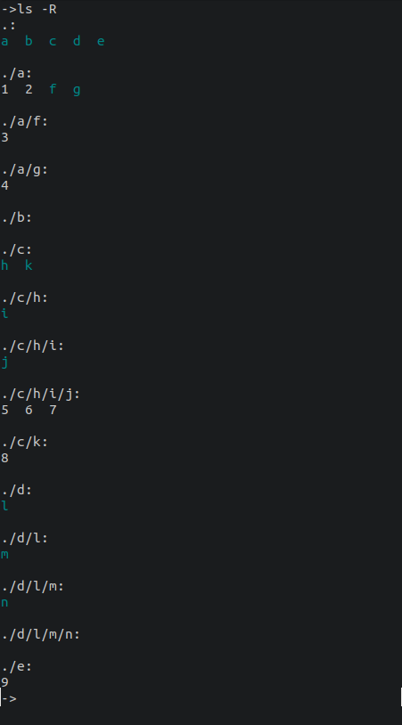
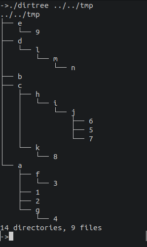

# Dir Tree

Prints the target directory and its children in a tree-like format.

## Steps

1. Read target directory string from args, or default to `$PWD`
1. Initialize file/dir counter
1. Iterate over all children of the target directory *(Check for hidden files and filter)*
1. Concatenate the child with the directory parent
1. If the file is the last on of its ancestor's children, print the end mark as prefix and recur
1. Otherwise, print the continue mark as prefix and recur

## Walk Function

**Input:** The path to the file or directory that will act as the root of the tree.

**Output:** A tree-like string

### Steps

1. Read input path children entries
1. Count number of entries
1. Iterate entry paths
1. Check if file or directory
    - Update counter
1. Check if last entry
1. Print entry
1. If directory, recur, updating preceding entry and prefix string

## Example

Consider a test directory.
The directories will be designated with letters, and the files with numbers.

We may then create the directories:
- `a`
- `a/f`
- `a/g`
- `b`
- `c`
- `c/h`
- `c/h/i`
- `c/h/i/j`
- `c/k`
- `d`
- `d/l`
- `d/l/m`
- `d/l/m/n`
- `e`

And the files:
- `a/{1,2}`
- `a/f/3`
- `a/g/4`
- `c/h/i/j/{5,6,7}`
- `c/k/8`
- `e/9`

This will create the following structure on the command `ls -R`:

Also, this will create the following tree structure:

